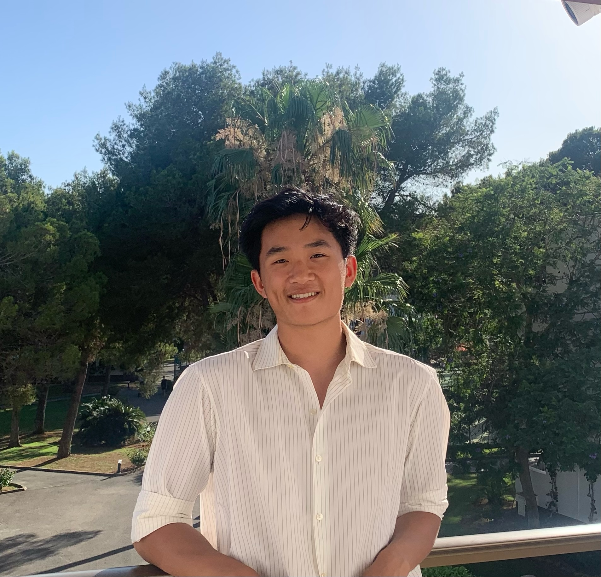

# Welcome to My User Page

## Introduction
Hello! I'm Evan Kauh, a passionate programmer and explorer of the digital and physical worlds. This page is a brief overview of who I am, both professionally and personally.

<!--  -->
<div align = "center"> 
    
</div>


### What I Do
I specialize in SDE and have worked on various projects in Java and Python. I love solving problems and building solutions that make a difference.

### Interests
- Artificial Intelligence
- Web Development
- Open Source
- Music! Check out my favorite song [here](https://www.youtube.com/watch?v=dQw4w9WgXcQ).

## My Projects
Here are some projects I've worked on:

1. **AI Chatbot** - A chatbot using natural language processing.
2. **Personal Portfolio** - My portfolio website showcasing my projects and blog. 


#### My Programming Philosophy
> "Code is like humor. When you have to explain it, it’s bad." - Cory House

Here's a small piece of code that I'm particularly proud of:

```python
def hello_world():
    print("Hello, world!")
hello_world()
